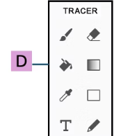
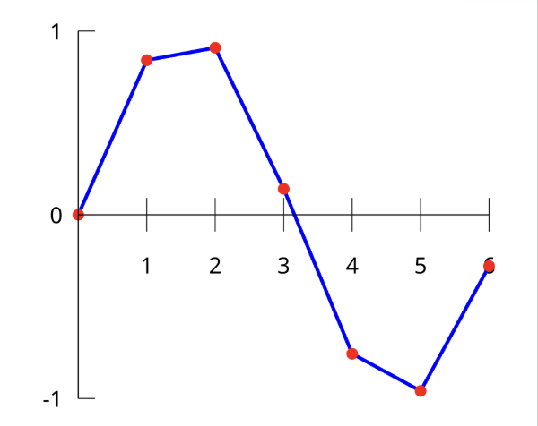
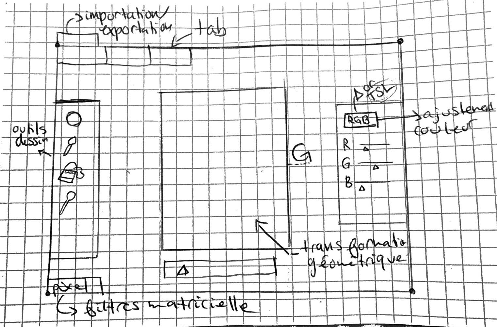

# Étapes de la modélisation 
- [1. Gestionnaire de fichier](#Gestionnaire-de-fichier)
    - [1.1 Exportation](#Exportation)
    - [1.2 Importation](#Importation)
- [2. Ajustement de la couleur](#Ajustement-de-couleur)
  - [2.1 Système TSV ou TSL](#21-système-tsv-ou-tslSystème TSV ou TSL)
  - [2.2 Système ]
- [3. Transformation géometrique](#Transformation-géométrique)
- [4. Outils de dessin](#Outils-de-dessin)
- [5. Filtres matricielle](#Filtres-matricielle)
- [6. Plan ui](#Plan-ui)

## 1. Gestionnaire de fichier

Le gestionnaire de fichier consiste a importer ou exporter une photo afin de la modifier. Pour gérer cela, on utilisera une fichier json. Le seule problème réside dans la transformation les données binaire d'une image en une suite de caractère string car le json refuse le binaire. En effet, json est un format base sur javascript. En gros, le language javascript utilise le texte pour les structure de donnée. Donc on est obligé de tous transformer en texte rendu dans les fichier json

### 1.1 Importation 

    1. Le programme ouvre l'image et les donne sont lit en octets
    2. Le programme procèede ensuite a l'encodage on passe de binaire a java text
    3. Le programme emballe l'image sous une étiquette
    4. Le programme sauvegarde le fichier dans le disque dur
   

### 1.2 Exportation

    1. Le programme lit le fichier json
    2. Le programme transforme le texte en octets
    3. Le programme copie les octed dans un fichier vierge 
    4. En appliquand la bonne extension .png .jpeg . Le syst`me reconnait L,image et l'exporte

## 2. Ajustement des couleurs

### 2.1 Système TSV ou TSL
En gros, toute midifcation de couleur que ce soit par le saturage, contraste, teinte etc.. joue avec les valeur des pixels tout simplement. Dans le cadre de notre projet, nous jouerons sur ces 3 aspects principale: teinte, saturation et luminisité. le fameux TSL. Le TSL est un système de couleur différent du RGB, on construit une couleur à partir de 3 composante : La teinte, La saturation et La lumière

#### 2.1.1 Teinte
La teinrte se défénit par la forme pur d'une couleur. En gros, c'est le tuple de donne RGB tout simplement. Celle-ci est souvent défénis par le modulo de 360 dans le cercle chromatique.

Donnée importantes:
- 0° ou 360° : rouge ;
- 60° : jaune ;
- 120° : vert ;
- 180° : cyan ;
- 240° : bleu ;
- 300° : magenta.

#### 2.1.2 Saturation
La saturation est l'intensité de la couleur. Celle-ci varie entre 0 et 100%. Plus une saturation est faible plus l'image est grise. 

Un très bon exemple est ceci

#### 2.1.3 Valeur ou lumière
La valeur représente seulment à quel point on se rapproche du noir ou du blanc. la valeur zéro représente le noir et la valeur 100 représente le blanc

### 2.2 Système RGB

Le système RGB est plus simple a comprendre. En gros chaque couleur crée est un mélange de différente valeur des 3 couleurs primaire. Ces trois couleur principales sont le rouge le vert et le bleu.

#### 2.2.1 Valeurs
Les valeurs de chaque couleur étant situé entre 0 et 225. La valeur de zéro représente le plus sombre et la valeur de 225 représente le plus clair

### 2.3 Conversion entre les deux système 
Pour qu'une couleur rgb passe au système hsv ou tsv, il faut faire en sorte de convertir les donnée de chaque système.

- Pour cela il existe une démarche scientifique

#### 2.3.1 De RGB à TSV

Imaginons une couleur rgb comme celle-ci : 
$$ (r,g,b) $$
chaque variable du système tsv possède sa formule 

##### 2.3.1.1 Teinte
$$
t =
\begin{cases}
0, & \text{si } \max = \min \\[6pt]
\left(60^\circ \times \dfrac{g-b}{\max-\min} + 360^\circ\right)
\bmod 360^\circ, & \text{si } \max = r \\[6pt]
60^\circ \times \dfrac{b-r}{\max-\min} + 120^\circ,
& \text{si } \max = g \\[6pt]
60^\circ \times \dfrac{r-g}{\max-\min} + 240^\circ,
& \text{si } \max = b
\end{cases}
$$

##### 2.3.1.2 Satruration
$$
s =
\begin{cases}
0, & \text{si } \max = 0 \\[6pt]
1-\dfrac{\min}{\max}, & \text{sinon}
\end{cases}
$$

##### 2.3.1.3 Valeur

$$
v = \max
$$

*** PETITE NOTE: quand on parle de maximum et de minimum on est entrain de discuter les plus grande  valeur du tuples $(r,g,b)$

##### 2.3.1.4 Explication simple des formule

Tout d'abord on cherche le maximum et le minimum. 

- Pour la valeur c'est simple on prend le maximum car celle-ci représente le niveau maximale de la luminosité de la couleur
- Pour la saturation, la pourcentage représente à quel point on s'éloigne du gris et que les couleur sont plus intenses donc 0%= completement gris. Donc avec la max et le min on peut déterminer la saturation. En effet, les compopsante sont différentes entre elles, plus la saturation est forte. pra exemple si une seul couleur est forte et les autres 0 la formule donnera 100% de saturation.
- Pour la teinte, c'est plus complexe. La fomule depend de quel couleur esrt au maximum pour situer la couleur principale ensuite on soustrait les deux autre couleur pour situer plus précisément cette couleur dans le cercle chromatique. Par exemple si le rouge est dominant. On soustrait le green et le bleu ensemble . Si le green est plus grand que blue , on se rapproche du jaune rouge, et à l'inverse on se rapprochera du rouge mangenta. Ainsi, si on divise par le max-min , c'est tout simplement pour normaliser. Pour de ce qui est la valeur 60 degres, c'est par ce que le cercle est divisé en 6 couleurs principales. 

#### 2.3.2 De TSV à RGB

- On commence d'abord par multiplier la saturation et la valeur qui va donner la quantité de couleur forte ou la composante forte  
$$ C= V\times\S $$

- Ensuite on va défénir une teinte prime $H^\prime$ qui sera le numéro du secteur dans lequel se trouve la couleur. En effet, le cercle est divissé en 6 sections de 60$^\circ$ chaque. Donc la formule:
$$ H^\prime= \dfrac{H}{60}$$ 

- Par la suite, la formule de :
$$ X= C (1- \abs{H^\prime mod 2-1})$$
Le X donne la composante intermédiaire parmi le rouge, vert et bleu

- Pour finir, X= intermediare et C= forte, Grace au $H^\prime$ on peut determiner dans quel section on est et la prochaine section ce tableasu indique clairement les section: 
  
- |    `H'` || Transition      |
- | ------: || --------------- |
- | `0 → 1` || rouge → jaune   |
- | `1 → 2` || jaune → vert    |
- | `2 → 3` || vert → cyan     |
- | `3 → 4` || cyan → bleu     |
- | `4 → 5` || bleu → magenta  |
- | `5 → 6` || magenta → rouge |

***Source ChatGPT

- Grâce a ces trois information, on est capable de créer un tuple rgb
- On classe dans le tuple en 4 étape
  1. Trouver la valeur de C
  2. Trouver la valeur de H prime
  3. Trouver la valwur de X
  4. Grace au H prime, trouver la couleur dominante parmi R,G,B et attribuer la valeur de C a celle-ci, 
  5. Trouver la valeur intermédiaire qui change , souvent diminue et donner la la valeur X
  6. Créer la combinaison et c'est terminé

- Combinaisons
$$
(R_1, G_1, B_1) =
\begin{cases}
(0,0,0) & \text{si } H \text{ est indéfini} \\
(C,X,0) & \text{si } 0 \leq H' < 1 \\
(X,C,0) & \text{si } 1 \leq H' < 2 \\
(0,C,X) & \text{si } 2 \leq H' < 3 \\
(0,X,C) & \text{si } 3 \leq H' < 4 \\
(X,0,C) & \text{si } 4 \leq H' < 5 \\
(C,0,X) & \text{si } 5 \leq H' < 6
\end{cases}
$$

## 3. Transformation géométrique

Il y a différentes type de transformation d'image: rigide et non rigide

### 3.1 Trnasformation rigide

 Les transformation rigides sont une forme de transformation ou la taille et les forme sont conservée. En gros, on parle seulment de deplacement (translation ou rotation et symetrie) dans l'espace. Cependant, cette transformation requiert une base d'algèbre linaire:

 En effet, il y'a toute un changement matricielle au niveau des coordonne de l'image

#### 3.1.1 Rotation
Imaginons on a un point $P=(x,y)$ et on veut le faire tourner selon un angle $\theta$, on a deux options: 
    1. Utiliser une matrice déja donnée
    2. Utiliser la méthode sans matrice un peu plus complexe

1. Matrice de rotation 
$$
R_\theta = \begin{pmatrix} 
\cos\theta & -\sin\theta \\ 
\sin\theta & \cos\theta 
\end{pmatrix}
$$

Et pour calculer la nouvelle coordonnée on procède avec cette formule 

$$
P' = R_\theta P
$$

2. Sans matrice (démonstration de la formule en 1.)

On considère un point $P = (x, y)$.
On peut écrire ses coordonnées à l'aide de sa distance $r$ à l'origine et de son angle $\alpha$ :

$$
x = r \cos\alpha
$$

$$
y = r \sin\alpha
$$

Après une rotation d'angle $\theta$, la distance $r$ ne change pas et l'angle devient :

$$
\alpha + \theta
$$

Le rayon ne change pas 

$$
x' = r \cos(\alpha + \theta)
$$

$$
y' = r \sin(\alpha + \theta)
$$

On utilise la formule trigonométrique : 

$$
\cos(a+b) = \cos a \cos b - \sin a \sin b
$$

Donc :

$$
x' = r [\cos\alpha \cos\theta - \sin\alpha \sin\theta]
$$

$$
x' = r \cos\alpha \cos\theta - r \sin\alpha \sin\theta
$$

Comme $r \cos\alpha = x$ et $r \sin\alpha = y$, on obtient :

$$
\boxed{x' = x \cos\theta - y \sin\theta}
$$

La même chose mais pour y prime
On utilise :

$$
\sin(a+b) = \sin a \cos b + \cos a \sin b
$$

Donc :

$$
y' = r [\sin\alpha \cos\theta + \cos\alpha \sin\theta]
$$

$$
y' = r \sin\alpha \cos\theta + r \cos\alpha \sin\theta
$$

Comme $r \sin\alpha = y$ et $r \cos\alpha = x$, on obtient :

$$
\boxed{y' = x \sin\theta + y \cos\theta}
$$

### Forme matricielle
On peut donc regrouper les deux formules sous forme matricielle :

$$
\boxed{
\begin{pmatrix}
x' \\
y'
\end{pmatrix}
=
\begin{pmatrix}
\cos\theta & -\sin\theta \\
\sin\theta & \cos\theta
\end{pmatrix}
\begin{pmatrix}
x \\
y
\end{pmatrix}
}
$$

#### 3.1.3 la symétrie 

La symétrie consiste a trouver le point mileu et inverser les coordonne des pixels vers l'autre coté du mileu:
$$
\begin{pmatrix}
i' \\
j'
\end{pmatrix}
=
\begin{pmatrix}
1 & 0 \\
0 & -1
\end{pmatrix}
\begin{pmatrix}
i - i_C \\
j - j_C
\end{pmatrix}
+
\begin{pmatrix}
i_C \\
j_C
\end{pmatrix}
$$

Les étapes de cette formule sont simples

1.  On donne la référence du centre de l,image au point (0,0) on veut que le centre possède cette coordonné cartésienne. 
$$\begin{pmatrix}
i - i_C \\
j - j_C
\end{pmatrix}$$

2. On applique le miroir: Puisque l'image est centre a (0,0): 
3. 

### 3.2 TRansformation non rigide

### 3.2.3 Agrandissement/réduction

Pour l'agrandissement et la réduction il y a deux méthode. 

#### 3.2.3.1 Agrandissement
Imaginons une image de 4 pixels :

- 🟥 🟦
- 🟩 🟨

on veut passer de 4 pixel (2x2) à 16 pixels (4x4): Pour se faire il ya deux méthode

1. Nearest voisin
 Cette méthode est souvent basé sur l'idée que l'ordinateur est presseux. En effet, lorsqu'on agrandit l'image il rest des pixel vides puisque l'ordineteur créee une nouvelle copie 4x4 et pour remplir les autres pixels, l'ordinateur pose une seul question:
 - Quel pixel est le plus proche du nouveau pixel que je dois remplir?
 - Si par exemple on veut colorier un pixel vide a l'extrême, l'ordinateur voit que le pixel rouge est le plus proche donc il va copier coller la couleur rouge. Cela donnerai cette image:

- 🟥 🟥 🟦 🟦
- 🟥 🟥 🟦 🟦
- 🟩 🟩 🟨 🟨
- 🟩 🟩 🟨 🟨

2. Bilinear
- ctte méthode comnsiste à calculer l'eéquilibre de tous les quatre couleur . Dans notre exemple, on va mélanger le bleu , rouge, vert et jaune afin d'avoir la couleur mauve et plusieurs couleur créer a partir des couleur originaux, qui donnerai un résultats comme ceci: 

- 🟥 🟥 🟪 🟦
- 🟥 🟥 🟪 🟦
- 🟫 🟫 🟨 🟨
- 🟩 🟩 🟨 🟨

3. Formules réelles
    1. nearest:
        $$
        I'(x', y') = I(\text{round}(x), \text{round}(y))
        $$
        *(ou avec la transformation inverse selon ton implémentation)*
        Avec :
         * $I$ : image originale
         * $I'$ : nouvelle image
         * $(x', y')$ : position du pixel dans la nouvelle image
         * $s$ : facteur d'agrandissement (zoom)
         * $\text{round}$ : fonction d'arrondi vers le pixel le plus proche
  
    2. bilinear
        $$
        f(x, y) = f(0,0)(1-x)(1-y) + f(1,0)x(1-y) + f(0,1)(1-x)y + f(1,1)xy
        $$
        **Variables et définitions :**
         * (x, y)$ : le nouveau pixel dont on cherche la couleur
         * $Q_{11}, Q_{12}, Q_{21}, Q_{22}$ : les 4 pixels connus entourant $P$
         * $f(Q)$ : la couleur ou la valeur du pixel
         * $x_1, x_2$ : les positions horizontales des pixels ($x_1 \le x \le x_2$)
         * $y_1, y_2$ : les positions verticales des pixels ($y_1 \le y \le y_2$)
#### 3.2.3.2 Réduction

Pour la réduction, c'est exactement le même principe sauf que l'on réduit le nombre de pixel et on adapte les même formule

## 4. Outil de dessin

Il exsite plusieurs outils de dessin que l'on utilise dans photshop, dans le cadre d'un projet simple nous utiliserons les 4 principale: 1. crayon 2. gomme a effacer 3. pipette 4. poit de peinture (simplifié)

### 4.1 Crayon
Le crayon se base sur une méthode mathématique qu'on appelele interpolation linéaire. L'écran suit la position de la souris et trace des petit point à chque cercle. Imaginons on a le point A (0,10) et le point B (5, 15) le pinceau trace des points à ces deux position donc on a un genre de .   .  .Cependant , il faut tracer une ligne entre les deux (le principe simple de dessiner au crayon). Donc, c'est la que la méthode d'interpolation linéaire vient: on veut trouver les points entre A et B pour pouvoir tracer une ligne. 

Pour expliquer cela on utilisera une graphique maqthématique 

- les points rouge sont les points $(x,y)$ 
- les ligne bleu font partie de la fonction d'interpolation

- 1. On cherche la différence entre A et B a l'abcisse et l'ordonnée
- 2. 5-0= 5 et 15-10=5 donc on avance de (1,1) à chaque pas si on veut 5 pas
- 3. si on veut être précis par exemple en 10 pas donc on avancerais de (0.5, 0.5)

Cependant, en programation, il existe une formule simple:
$$
\bar{f}(x) = y_a + (x - x_a) \frac{y_b - y_a}{x_b - x_a}
$$

### 4.2 Gomme a effacer
La gomme a effacer fait en sorte que les pixel passe a une couleur opaque c'est à dire ou la alpha est de zéro. Pour augmenter la taille c'est simple on augmenter la rayon 

Le centre de la gomme suiverai la souris
$$C=(xc​,yc​)$$ 
- Pour chaque pixel on calcule la distance au centre 
- $$d = \sqrt{(x - x_c)^2 + (y - y_c)^2}$$ 
- Et si la distance  d est plus petite que le rayon donc le pixel est touché par la gomme et en conséquence son opacité devient 0 donc transparent
* Si $d \le r$ $\rightarrow$ le pixel est dans la gomme $\rightarrow \alpha = 0$
* Si $d > r$ $\rightarrow$ le pixel n'est pas touché $\rightarrow$ on ne change rien.

### 4.3 pipette
L'outil de la pipette est l'outil le plus simple qui soit. 
- D'abord on trouver la position de la pipette
- Ensuite on trouve le pixel associé à cette position 
- Enfin on collecte les informations de ce pixel et on affcihe la couleur
Le plus dure c'est de relier la pipette au pinceau mais il semble simple à faire 

### 4.4 Remplissage (pot de peinture)(méthode simplifié)
Le pot de peinture est simple notamment. D'abord on choisi une couleur ensuite on transforme tous les donne des pixels concernant leur couleur en une seule couleure.

## 5. Filtres matricielle 
Les logiciel de traitement d'image possède plusiers filtres matricelle souvent a but aesthetique (peinture a l'huile , effet tuile etc..). Pour notre projet simplifié, nous procéderons à un seul exemple:  la pixelisation

### 5.1 La pixelisation 
La pixelisation consiste à augmeter le nombre de pixel d'une image donnant un effet de mauvaise qualité. Cependant dans le monde de l'art il peut etre vus comme esthétique donnant une autre vibe à l'image

Si on reste en format png ou jpeg, il sera facile de pixeliser, tout ce que on fait c'est agrandir l'image , cependant pour d'autre format d'image 

## 6. Plan ui

## Sources:

- [Teinte, Saturation et Valeur](https://fr.wikipedia.org/wiki/Teinte_Saturation_Valeur)
- [Cercle Chromatique)](https://fr.wikipedia.org/wiki/Cercle_chromatique)
- [convert hsv to rgb colors?](https://cs.stackexchange.com/questions/64549/convert-hsv-to-rgb-colors?newreg=92c1aa9ebcbb4d7ebb56b7c3373b36a8)
- [Bilinear interpolation](https://en.wikipedia.org/wiki/Bilinear_interpolation?utm_source=chatgpt.com)
- [Bilinear interpolation](https://web.pdx.edu/~jduh/courses/geog493f09/Students/W6_Bilinear%20Interpolation.pdf)
- [algebre lineaire et imagerie numerique](https://fredbl.gitlab.io/algebre-lineaire-et-imagerie-numerique/geometrie.html)

